  

<h3><code>richard@nezzontli:~$ whoami</code></h3>

Physics student. I care about the scientific method, free software, and treating
privacy as the default rather than a feature.

**Learning** — Electromagnetism · Vector spaces · Algebra · Oscillations and waves · BSD systems administration · Suckless tools

**Interests** — Digital privacy · FOSS · Cryptography · Decentralized tech (Monero, Tor, GrapheneOS) · Experimental physics · Embedded systems · Violin · Cycling · Analog photography · Track and field

<h3><code>richard@nezzontli:~$ ./contributions.sh</code></h3>

  

<h3><code>richard@nezzontli:~$ ./links.sh</code></h3>

  
  
  
  
  

<h3><code>richard@nezzontli:~$ cat stack.txt</code></h3>

  
  
  
  
  

<h3><code>richard@nezzontli:~$ cat env.txt</code></h3>

  
  
  
  
  
  

---

<em>"Privacy is not something that I'm merely entitled to, it's an absolute prerequisite."</em> — Marlon Brando

